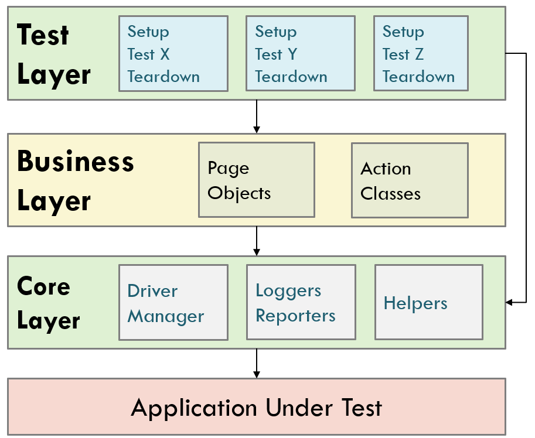

# GUI Automation Framework

Mobile GUI automation framework in C#, extensible for other types of GUIs (desktop, web). It is a base framework that tries to apply best practices in a layered architecture. The example automated test was done for [Loop Habit Traker](https://github.com/iSoron/uhabits), an open source mobile project that helps you create and maintain good habits, initially developed by [Alinson S. Xavier](https://github.com/iSoron).

## Tools
- .NET 6
- NUnit
- Appium 2.*
- Appium Inspector
- Browserstack App Automate
- Visual Studio

## Requirements
In order to have this framework working locally, you need to install:
- Appium 2.* ([NPM required for installation](https://appium.io/docs/en/2.1/quickstart/install/))
- Appium Inspector (releases [here](https://github.com/appium/appium-inspector/releases))
- .NET 6
- Android Virtual Device (Android Studio can be used to manage emulated devices)

## Usage
To start running tests, the best an easies way is through the Test Explorer on Visual Studio, preferably on VS2022.
You will need to have an Appium server running, by default at http://localhost:4723.
It is also necessary to have an AVD running, or a real device conected to your computer, which will be recognized by appium.
Set all the info needed on configuration.json (appPackage, appActivity).
To run tests on Browserstack, you can create a trial account, which includes 100 free minutes, and you need to specify the device you want to run the tests on, with "deviceName", "platformVersion", and upload the .apk of your app, which will return a URL that have to be set on "app". Finally, you have to provide your Browserstack username and access key.

Another way to run tests is with the dotnet test command, you can find more info [here](https://learn.microsoft.com/en-us/dotnet/core/tools/dotnet-test)